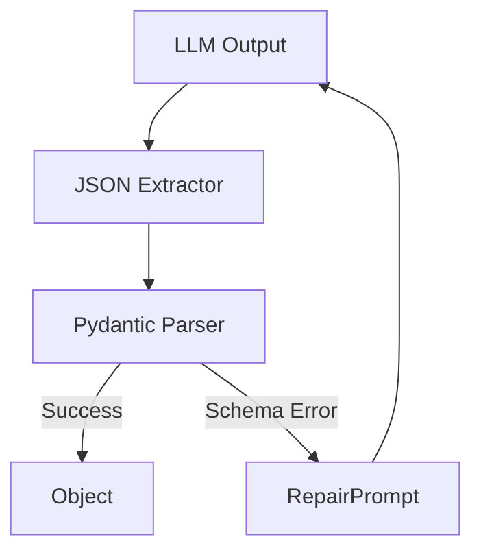

# Structured Output Parser

> **A resilience layer that coerces LLM outputs into Pydantic models with graceful fallbacks.**

---

## 🧠 Mental Model

### The Problem
LLMs are probabilistic text generators, but software systems require deterministic, structured data (JSON).
Common failure modes include:
- Wrapping JSON in Markdown code blocks (```json ... ```).
- Trailing commas or missing quotes (invalid JSON).
- Hallucinating fields not in the schema.

### The Solution
We treat the LLM output as "potential data" and pass it through a rigorous validation pipeline:
1.  **Extraction**: Strip logic to find the JSON blob in the text.
2.  **Validation**: Use Pydantic to enforce types and constraints.
3.  **Repair**: If validation fails, re-feed the error message back to the LLM (Self-Correction).

### When to use this
*   [x] Integrating LLMs into legacy APIs.
*   [x] Generating config files or data objects.
*   [ ] Free-form creative writing (use raw text instead).

---

## 🏗️ Architecture

The system uses a `Tenacity` retry loop to handle transient failures and a "Repair Loop" for schema errors.



## ⚠️ Risks & Ethics

See [ETHICS.md](ETHICS.md).
- **Fallbacks**: If the model fails 3 times, do we crash or return a default?
- **Injection**: Can strict schemas prevent prompt injection? (No, but they sanitize the *structure* of the output).
