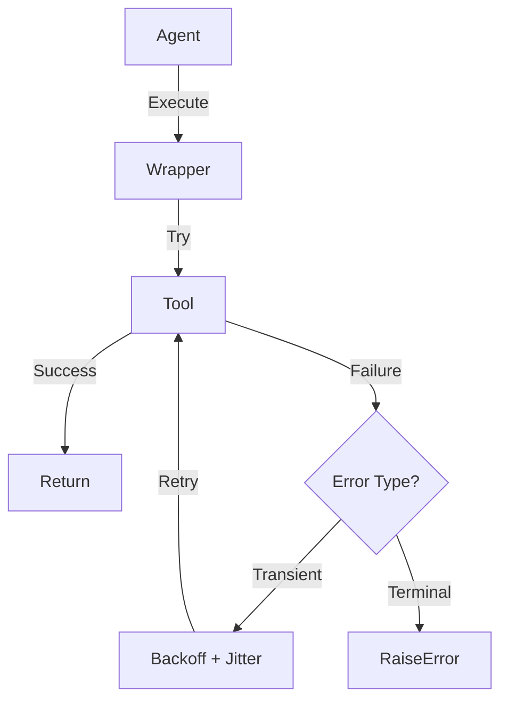

# Function Call Retry Engine

> **Smart resilience layer for AI tool execution with exponential backoff and error classification.**

---

## 🧠 Mental Model

### The Problem
AI agents rely on external tools (APIs, databases). These are flaky.
Naive retries (trying 3 times immediately) fail during outages or rate limits.
Retrying on *everything* (like 400 Bad Request) is wasteful and potentially dangerous.

### The Solution
A "Smart Executor" that wraps tool calls:
1.  **Classifies Errors**: Transient (Rate Limit, 503) vs. Terminal (400, 401).
2.  **Backs Off Exponentially**: Wait 1s, 2s, 4s... with jitter to prevent thundering herds.
3.  **Circuit Breaker**: Stops completely if a tool fails consistently.

### When to use this
*   [x] Calling unreliable public APIs.
*   [x] High-throughput agent systems where rate limits are common.

---

## 🏗️ Architecture

## ⚠️ Risks & Ethics

See [ETHICS.md](ETHICS.md).
- **Cost**: Retries consume quota.
- **Side Effects**: Only retry *idempotent* operations. Retrying "Send Email" might send it twice.
