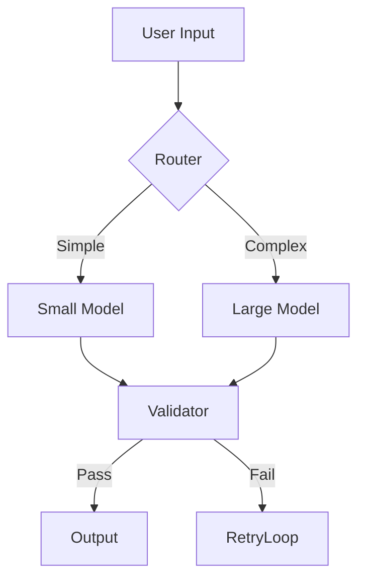

# Architecture & Design

## 📐 System Diagram

## 🔄 Data Flow
1.  **Input Processing**: ...
2.  **Core Logic**: ...
3.  **Output Validation**: ...

## ⚖️ Tradeoffs

| Decision | Alternative | Why we chose this |
|---|---|---|
| **Library** | `pydantic` vs `marshmallow` | Better typing support |
| **Model** | `gpt-3.5-turbo` | Speed/Cost balance |

## 🔍 Observability
- **Spans**: We track `llm_call`, `validation`, and `retry`.
- **Metrics**: `token_usage`, `latency_ms`.
