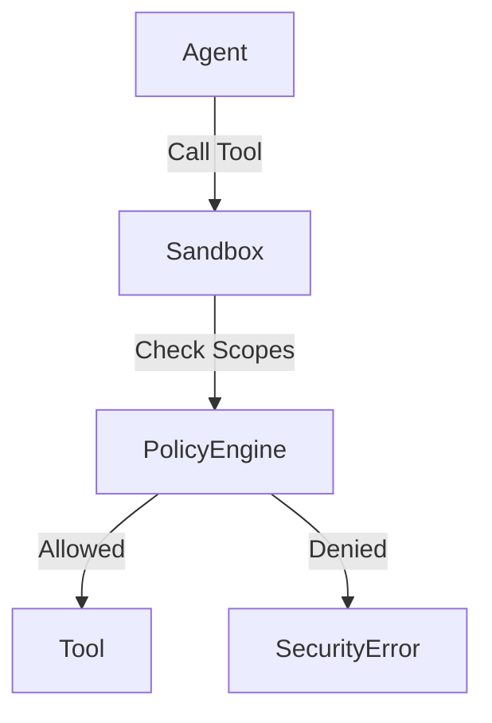

# Tool Permission Sandbox

> **A security layer that enforces capability-based access control for AI tools.**

---

## 🧠 Mental Model

### The Problem
If an agent has access to `delete_database()` and `read_database()`, how do we ensure it doesn't delete production data when asked to "summarize the logs"?
Broad tool access is dangerous. We need granular permissions ("scopes") similar to OAuth.

### The Solution
A middleware layer that intersects the **Agent's Scopes** with the **Tool's Required Scopes**.
- Each tool declares what it needs: `requires=["db:write"]`
- Each agent session has granted scopes: `granted=["db:read"]`
- The Sandbox blocks execution if scopes identify a violation.

### When to use this
*   [x] Deployment of agents with "write" capabilities.
*   [x] Multi-tenant environments where agents act on behalf of specific users.

---

## 🏗️ Architecture

## ⚠️ Risks & Ethics

See [ETHICS.md](ETHICS.md).
- **Scope Creep**: Developers might grant `admin` convenience.
- **Granularity**: Too fine (friction) vs too coarse (security risk).
