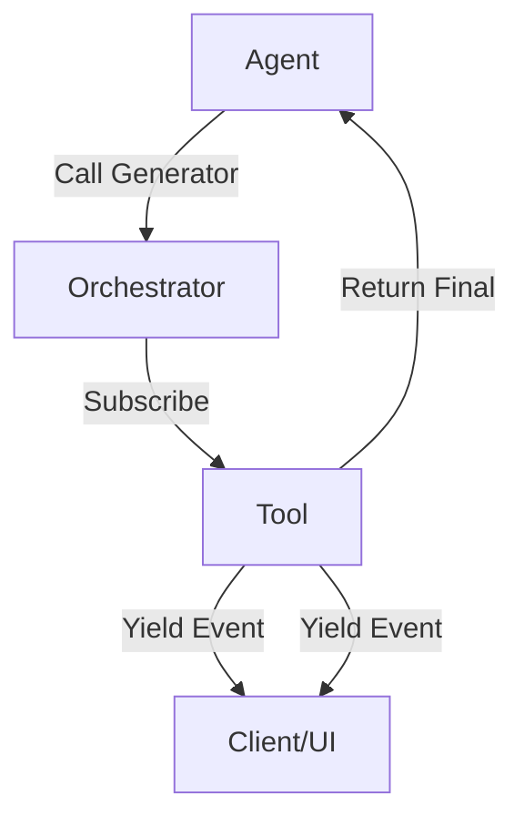

# Streaming Tool Orchestrator

> **Execute long-running tools while streaming partial results and progress indicators.**

---

## 🧠 Mental Model

### The Problem
Some tools take seconds or minutes (e.g., "Search 50 PDFs").
Standard Request/Response blocks the UI, making the agent feel "frozen".
Users interpret silence as failure.

### The Solution
Tools should be **Generators**, not Functions.
They yield state updates: `{"status": "searching", "progress": 10}` ... `{"status": "summarizing", "progress": 80}`.
The Orchestrator consumes these events and updates the UI real-time.

### When to use this
*   [x] RAG pipelines with multiple steps.
*   [x] Image generation/processing tools.
*   [x] Complex calculations.

---

## 🏗️ Architecture

## ⚠️ Risks & Ethics

See [ETHICS.md](ETHICS.md).
- **Complexity**: Requires async/generator handling in the agent core.
- **Network Overhead**: Streaming sends more data frames.
