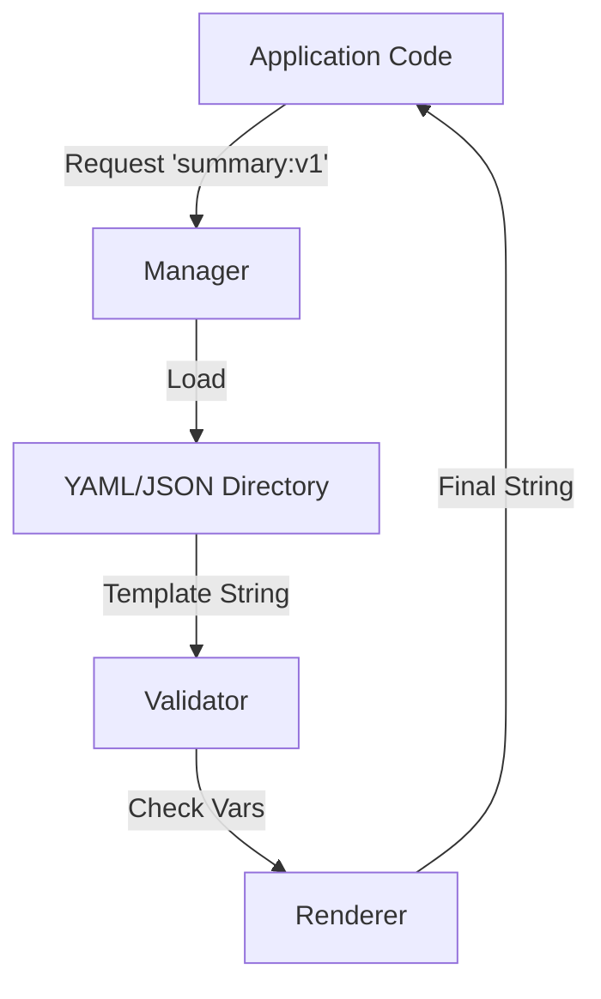

# Prompt Template Manager

> **Decouple prompts from code with a versioned, strictly-typed template system.**

---

## 🧠 Mental Model

### The Problem
Hardcoding strings like `prompt = f"Summarize {text}"` in Python code is bad practice.
*   **No Versioning**: Hard to track prompt changes over time.
*   **No Testing**: Can't A/B test prompts easily.
*   **Messy Code**: Large multi-line strings clutter logic.

### The Solution
Treat prompts as **Code Artifacts** or **Config**.
1.  **Registry**: Load prompts from a directory or config file.
2.  **Versioning**: `summarize:v1`, `summarize:v2`.
3.  **Validation**: Ensure all variables (`{text}`) are provided at runtime.

### When to use this
*   [x] Production systems with >5 prompts.
*   [x] Teams where non-engineers (PMs) iterate on prompts.

---

## 🏗️ Architecture

## ⚠️ Risks & Ethics

See [ETHICS.md](ETHICS.md).
- **Complexity**: Over-engineering simple scripts.
- **Security**: If templates are loaded from DB/User input, watch for Server-Side Template Injection (SSTI).
