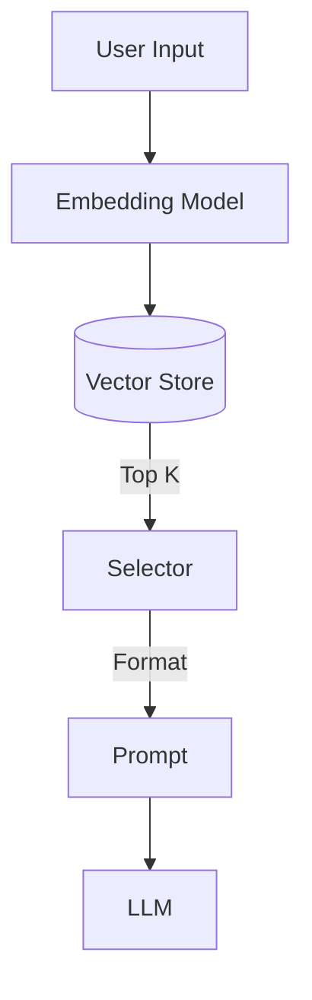

# Few-Shot Example Selector

> **Dynamically select the most relevant examples to include in the prompt.**

---

## 🧠 Mental Model

### The Problem
Providing examples ("few-shot") improves LLM performance significantly.
However, context windows are limited. You can't fit 100 examples.
Static examples might be irrelevant to the current user query.

### The Solution
A "Selector" that picks the Top-K most relevant examples from a database.
1.  **Embed**: Content of examples (input/output pairs).
2.  **Query**: Embed user's current input.
3.  **Search**: Find nearest neighbors (Cosine Similarity).
4.  **Inject**: Format only those K examples into the prompt.

### When to use this
*   [x] Classification tasks with many edge cases.
*   [x] SQL generation (include schemas/queries relevant to the question).
*   [x] Style mimicking (pick examples with similar tone).

---

## 🏗️ Architecture

## ⚠️ Risks & Ethics

See [ETHICS.md](ETHICS.md).
- **Determinism**: The prompt changes for every query. Harder to debug.
- **Bias**: If the example set is biased, the dynamic selection reinforces it.
