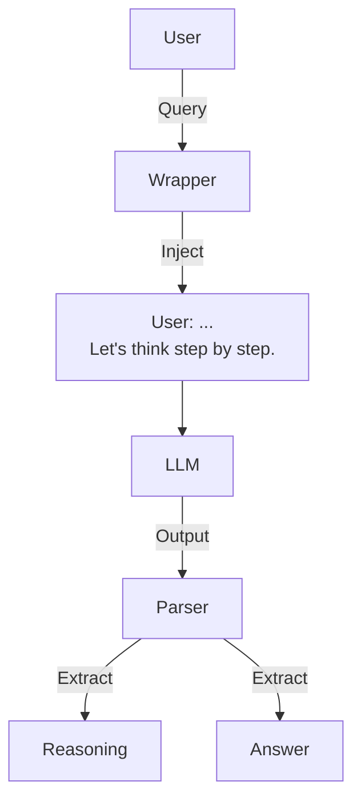

# Chain of Thought Generator

> **Force models to think step-by-step before answering.**

---

## 🧠 Mental Model

### The Problem
LLMs guess the next token immediately. For complex math or logic, this fails.
"What is 23 * 4 + 10?" -> "92" (Wrong? Maybe right? Model guesses).

### The Solution
Force the model to output a **Reasoning Trace** before the **Final Answer**.
Patterns:
1.  **Zero-Shot CoT**: "Let's think step by step."
2.  **Manual CoT**: Providing examples with reasoning steps (Few-Shot CoT).
3.  **Structured CoT**: Enforcing XML tags `<thought>...</thought><answer>...</answer>`.

### When to use this
*   [x] Math/Logic problems.
*   [x] Complex classification (Policy analysis).
*   [x] Coding tasks (Plan before Code).

---

## 🏗️ Architecture

## ⚠️ Risks & Ethics

See [ETHICS.md](ETHICS.md).
- **Latency**: CoT uses more tokens (slower/more expensive).
- **Fake Reasoning**: Model might hallucinate reasoning to justify a wrong answer (Post-hoc rationalization).
