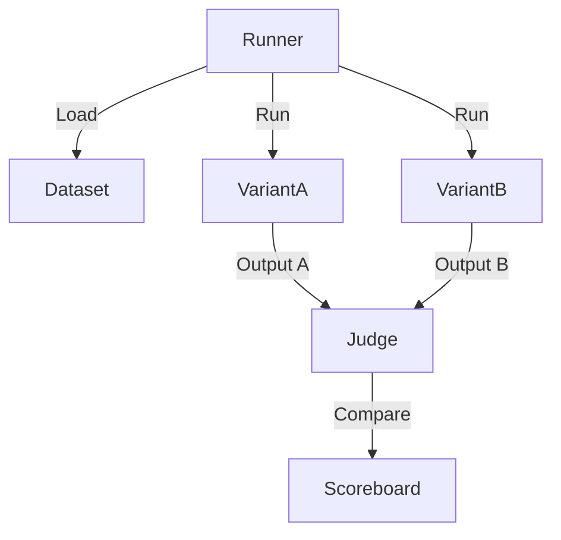

# Prompt A/B Testing Framework

> **Systematically compare prompts to maximize performance.**

---

## 🧠 Mental Model

### The Problem
"Is 'Be concise' better than 'Short answers only'?"
Humans are bad at guessing. We need data.
Manual testing is slow and anecdotal ("It felt faster").

### The Solution
An experiment runner that:
1.  **Definitions**: Takes Variant A and Variant B.
2.  **Dataset**: Runs both against a Golden Dataset.
3.  **Evaluator**: Uses an LLM-as-a-Judge or heuristic to score each output (Win/Loss).
4.  **Analysis**: Reports "Variant B is 15% better at formatting."

### When to use this
*   [x] Optimizing system prompts for production agents.
*   [x] Choosing between models (GPT-4 vs GPT-3.5 + better prompt).

---

## 🏗️ Architecture

## ⚠️ Risks & Ethics

See [ETHICS.md](ETHICS.md).
- **Cost**: A/B testing doubles the token cost (running everything twice).
- **Judge Bias**: The LLM judge might prefer verbose answers, skewing results.
