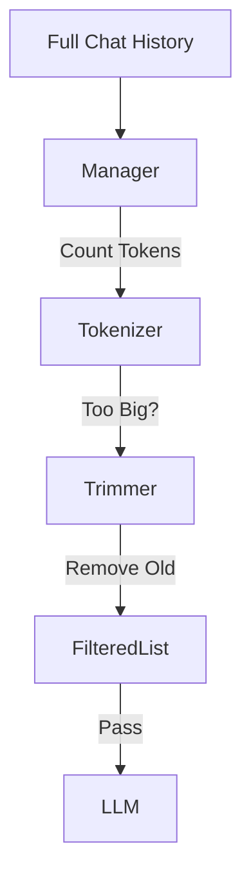

# Context Window Manager

> **Fit infinite conversations into finite context windows.**

---

## 🧠 Mental Model

### The Problem
LLMs have a fixed limit (4k, 8k, 128k tokens).
Input > Limit = Crash (or costly truncation).
Chat history grows linearly.

### The Solution
A "Context Manager" that acts as a sliding window or an intelligent filter.
1.  **Count**: Accurately estimate tokens (using tiktoken).
2.  **Trim**: Remove oldest messages (FIFO).
3.  **Preserve**: Always keep the `system` message and the `last_user` message.

### When to use this
*   [x] Long-running chat bots.
*   [x] RAG applications where retrieved docs take up 90% of space.

---

## 🏗️ Architecture

## ⚠️ Risks & Ethics

See [ETHICS.md](ETHICS.md).
- **Amnesia**: The bot forgets important details from 20 turns ago.
- **Cost**: Counting tokens locally prevents sending massive payloads to the API, saving money.
