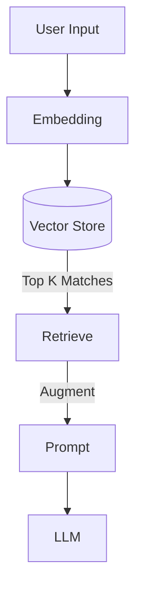

# Semantic Memory (Vector RAG)

> **Long-term memory retrieval using vector embeddings.**

---

## 🧠 Mental Model

### The Problem
Ephemeral memory (Project 12) vanishes when the process dies.
Keywords search is brittle ("puppy" doesn't match "dog").
Agents need to remember facts from days ago.

### The Solution
**Retrieval Augmented Generation (RAG)** on chat history.
1.  **Embed**: Turn text into vectors (numbers).
2.  **Store**: Save vectors in a DB (Chroma, Pinecone, or local JSON for demo).
3.  **Retrieve**: Find similar past conversations when the user asks a question.

### When to use this
*   [x] Personalizing responses based on past preferences.
*   [x] Recalling facts mentioned in previous sessions.

---

## 🏗️ Architecture

## ⚠️ Risks & Ethics

See [ETHICS.md](ETHICS.md).
- **Stale Data**: Old facts might contradict new ones ("I live in NY" -> "I moved to CA").
- **Privacy**: Storing user chat permanently requires consent and "Right to be Forgotten" (delete endpoints).
