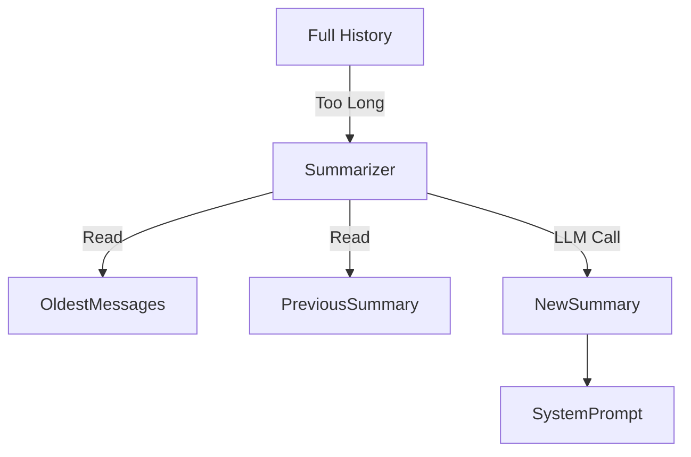

# Recursive Summary Memory

> **Maintain a rolling summary of the conversation to extend the effective context window.**

---

## 🧠 Mental Model

### The Problem
Chat history eventually exceeds the context window (Project 11 trims it).
Trimming deletes information (the user's name mentioned in turn 1 is lost by turn 50).

### The Solution
Instead of deleting old messages, **Summarize** them.
System Prompt: `Current Summary: {summary}`
When history > limit:
1.  Take the oldest 5 messages.
2.  Ask an LLM to condense them into the existing summary.
3.  Replace those 5 messages with the new summary string.

### When to use this
*   [x] Extremely long roleplay or storytelling sessions.
*   [x] Task agents that need to remember the "Goal" stated at the start.

---

## 🏗️ Architecture

## ⚠️ Risks & Ethics

See [ETHICS.md](ETHICS.md).
- **Compression Loss**: Nuance is lost in summarization.
- **Hallucination**: The summarizer might invent details that weren't there.
