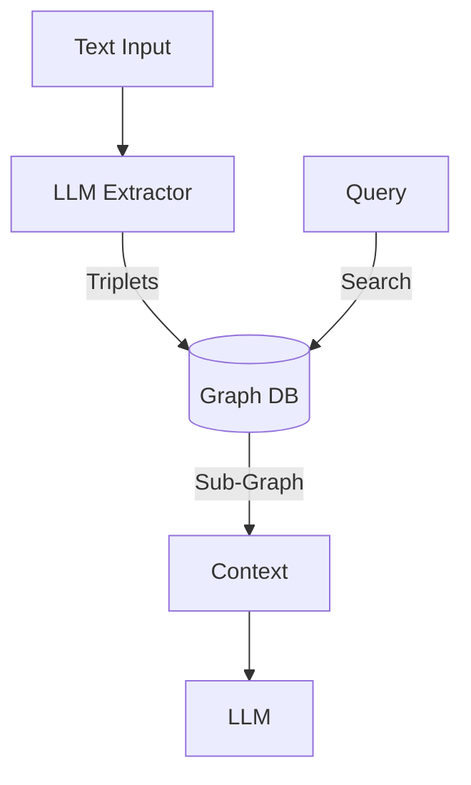

# Entity Knowledge Graph Memory

> **Extract and store structured facts about entities and their relationships.**

---

## 🧠 Mental Model

### The Problem
Vector search (Project 13) is fuzzy. "Who is Alice's manager?" might fail if the text says "Alice reports to Bob."
Vectors capture intent, but Graphs capture **Relations**.

### The Solution
Extract structured triplets: `(Source, Relation, Target)`.
`(Alice, reports_to, Bob)`
`(Bob, is_manager_of, Engineering)`
When asking "Who manages Alice?", we traverse the graph: `Alice -> reports_to -> ?`.

### When to use this
*   [x] CRM Agents (Customer relationships).
*   [x] RPG NPCs (Who knows whom).
*   [x] Complex reasoning where "A implies B" matters.

---

## 🏗️ Architecture

## ⚠️ Risks & Ethics

See [ETHICS.md](ETHICS.md).
- **Extraction Errors**: "Alice likes Apple" (Fruit or Company?). LLMs struggle with entity resolution.
- **Explosion**: Graph grows O(N^2) if every noun is an entity. Need strict schemas.
