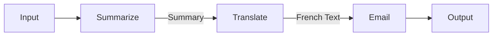

# Linear Chain Executor

> **Execute a predefined sequence of steps deterministically.**

---

## 🧠 Mental Model

### The Problem
Not every "agent" needs a dynamic loop.
Some tasks are strict pipelines: `Input -> Summarize -> Translate -> Email`.
Using a full ReAct loop for this is flaky (it might skip a step).

### The Solution
A **Linear Chain** (or "Pipeline") pattern.
1.  **Define Steps**: A list of functions or prompts.
2.  **Pass State**: Output of Step 1 becomes Input of Step 2.
3.  **Execute**: Run sequentially.

### When to use this
*   [x] Content processing pipelines (ETL).
*   [x] STRICT business processes (Approval flows).

---

## 🏗️ Architecture

## ⚠️ Risks & Ethics

See [ETHICS.md](ETHICS.md).
- **Rigidity**: If Step 1 fails or produces unexpected output, the chain breaks.
- **No Correction**: Unlike ReAct, it can't "go back" and fix a mistake.
