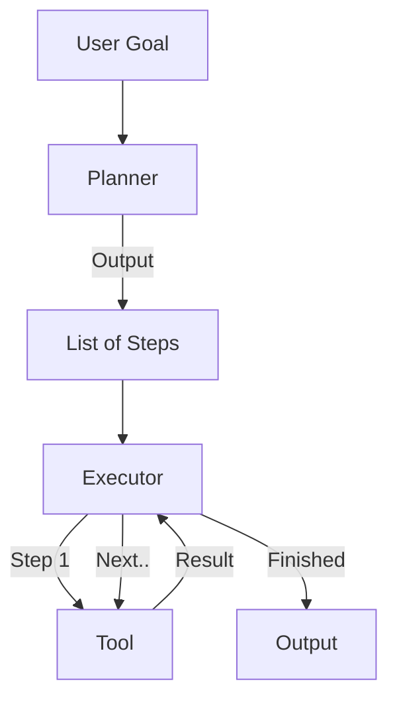

# Dynamic Plan-and-Execute Agent

> **Separate planning ("What to do") from execution ("How to do it").**

---

## 🧠 Mental Model

### The Problem
ReAct loops (Reason+Act) often get "lost in the weeds" on complex tasks.
The model forgets the high-level goal while struggling with a sub-step.
"I solved step 1, but what was step 2 again?"

### The Solution
Two distinct phases (or Agents):
1.  **Planner**: Decomposition. "Break this goal into 5 steps."
2.  **Executor**: Action. "Do Step 1. Done. Do Step 2. Done."
3.  **Replanner** (Optional): "Step 2 failed. Updated plan: ..."

### When to use this
*   [x] Complex research tasks ("Write a report about X").
*   [x] Tasks with non-linear dependencies.

---

## 🏗️ Architecture

## ⚠️ Risks & Ethics

See [ETHICS.md](ETHICS.md).
- **Latency**: Planning adds overhead.
- **Hallucinated Plans**: The planner might invent steps for tools that don't exist.
