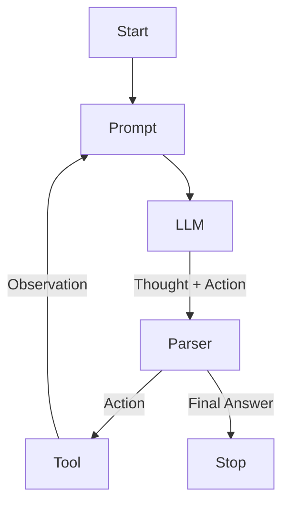

# ReAct Loop Architecture

> **Reason and Act. The fundamental loop of modern agents.**

---

## 🧠 Mental Model

### The Problem
Linear chains (Project 16) are too rigid.
Plan-and-Execute (Project 17) can be slow to adapt.
Agents need to "feel their way" through a problem.

### The Solution
**ReAct** (Reason + Act).
A `while` loop that prompts the model:
`Thought`: What should I do next?
`Action`: Call a tool.
`Observation`: See the result.
`Thought`: Did that work? What now?
... until `Final Answer`.

### When to use this
*   [x] Open-ended questions ("Who is older, the president of France or the King of England?").
*   [x] Tasks requiring exploration.

---

## 🏗️ Architecture

## ⚠️ Risks & Ethics

See [ETHICS.md](ETHICS.md).
- **Infinite Loops**: "I need to check the weather. I need to check the weather." (Needs max_steps).
- **Token Bleed**: The context grows with every step.
