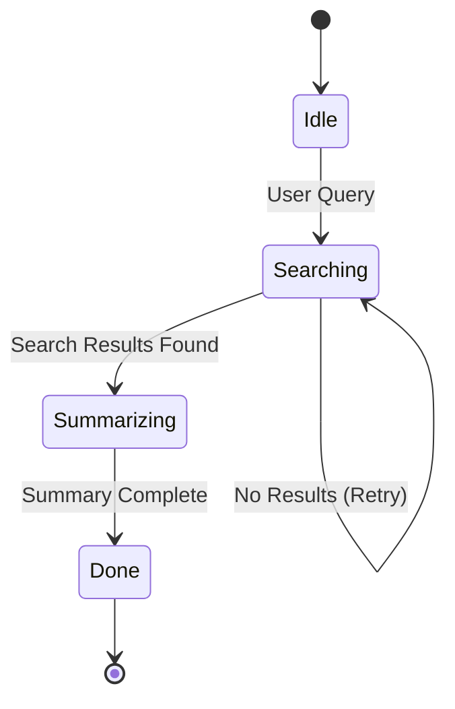

# Finite State Machine (FSM) Agent

> **Constrain agent behavior to a directed graph of valid states.**

---

## 🧠 Mental Model

### The Problem
ReAct agents are "open world." They can do anything at any time.
Sometimes you need strict process control:
"You MUST Search first. Then you MUST Summarize. You cannot Summarize before Searching."

### The Solution
**Finite State Machine**.
1.  **States**: `IDLE`, `SEARCHING`, `SUMMARIZING`, `DONE`.
2.  **Transitions**: `IDLE` -> `SEARCHING` (on Event: "User Query").
3.  **Actions**: Each state has a specific instruction/toolset.

### When to use this
*   [x] Customer Support (Triage -> Verify Auth -> Resolve -> Survey).
*   [x] Game NPCs (Patrol -> Alert -> Attack -> Search).

---

## 🏗️ Architecture

## ⚠️ Risks & Ethics

See [ETHICS.md](ETHICS.md).
- **Deadlocks**: Getting stuck in a loop between two states.
- **Complexity Explosion**: Managing N states means N^2 possible transitions.
