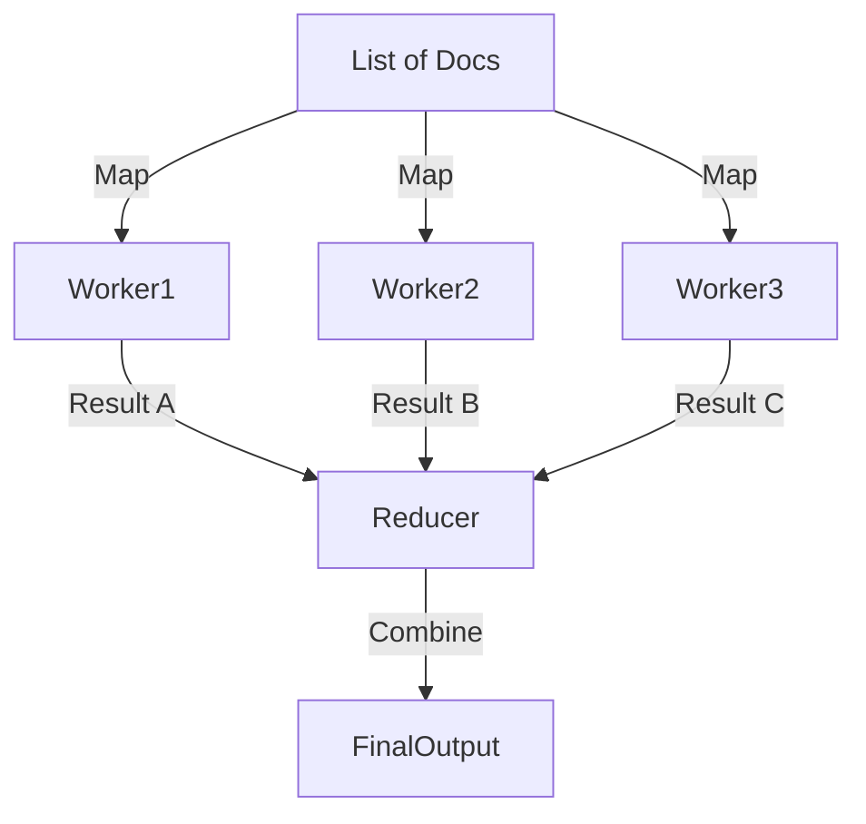

# Parallel Execution (Map-Reduce)

> **Speed up processing by parallelizing independent tasks.**

---

## 🧠 Mental Model

### The Problem
Processing 10 documents sequentially takes 10x time.
"Summarize these 50 news articles." -> 50 minutes?
LLMs are stateless, so we can run them in parallel.

### The Solution
**Map-Reduce Pattern**.
1.  **Map**: Apply a function (e.g., "Summarize") to every item in the list in parallel.
2.  **Reduce**: Combine the results into a single output (e.g., "Summarize the summaries").

### When to use this
*   [x] Summarizing large documents (chunking).
*   [x] Voting (ask 3 different personas).
*   [x] Batch processing emails.

---

## 🏗️ Architecture

## ⚠️ Risks & Ethics

See [ETHICS.md](ETHICS.md).
- **Rate Limits**: Parallel calls might hit the API limit instantly (429 errors). Needs a Semaphore.
- **Cost**: It's easy to accidentally spend $50 by spawning 1,000 workers.
