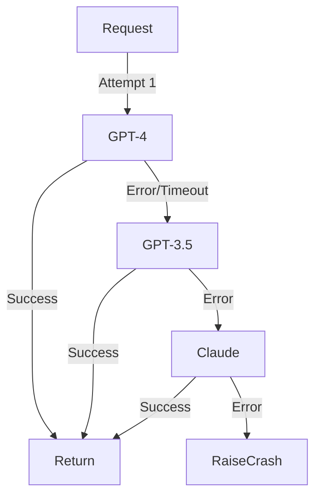

# Model Fallback Cascade

> **Ensure reliability by falling back to alternative models when the primary fails.**

---

## 🧠 Mental Model

### The Problem
API providers go down.
Rate limits get hit.
Sometimes the "Big Model" is too slow or refuses a prompt that a "Small Model" might handle (or vice versa).
Crashing is unacceptable in production.

### The Solution
A **Cascade** of models.
1.  Try `Primary` (e.g., GPT-4).
2.  If Timeout/Error -> Try `Fallback 1` (e.g., GPT-3.5).
3.  If Error -> Try `Fallback 2` (e.g., Local LLaMA or Claude).
4.  Return first success.

### When to use this
*   [x] High-uptime service guarantees (SLA).
*   [x] Cost optimization (Try cheap model first, upgrade if it fails validation?). *Note: This project focuses on Error Fallback, not speculatve upgrade.*

---

## 🏗️ Architecture

## ⚠️ Risks & Ethics

See [ETHICS.md](ETHICS.md).
- **Quality Drop**: The backup model might be dumber. The user might notice the degradation.
- **Consistency**: Different models have different formatting quirks.
