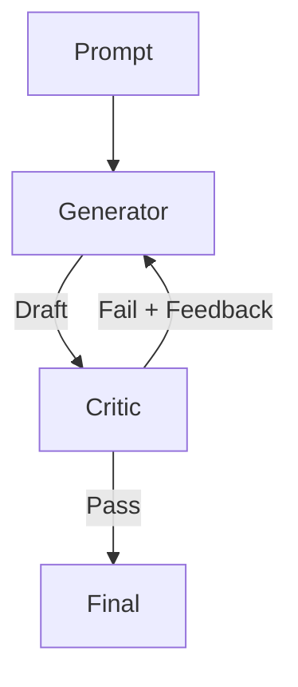

# Hallucination Detector (Reflexion)

> **Catch and fix errors before the user sees them.**

---

## 🧠 Mental Model

### The Problem
LLMs make things up ("Python 3.14 was released in 1990").
Direct generation is prone to "system 1" thinking (fast errors).
We need a "system 2" check.

### The Solution
**Reflexion Loop**.
1.  **Draft**: Model generates an answer.
2.  **Critique**: Model (or another model) evaluates the answer for factual consistency using citations or logic.
3.  **Revise**: Model generates a new answer based on the critique.

### When to use this
*   [x] Code generation (Critique = "Does it compile?").
*   [x] Factual Q&A (Critique = "Are facts supported by context?").

---

## 🏗️ Architecture

## ⚠️ Risks & Ethics

See [ETHICS.md](ETHICS.md).
- **Double Hallucination**: The critic might hallucinate a problem that doesn't exist, ruining a good answer.
- **Latency**: Multiplies the time by 2x or 3x.
