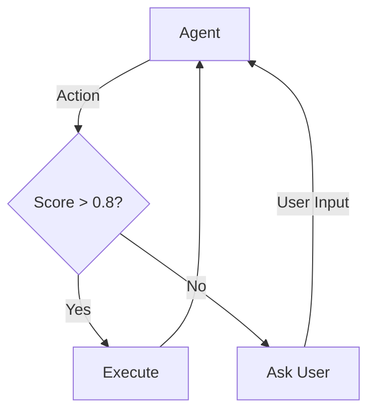

# Human-in-the-Loop Hand-off

> **Pause automation and request human intervention when confidence is low.**

---

## 🧠 Mental Model

### The Problem
Agents are not perfect. In critical domains (healthcare, finance), 99% accuracy isn't enough.
Sometimes the agent encounters a situation it hasn't seen before.

### The Solution
**Confidence-Based Handoff**.
1.  **Monitor**: Calculate a confidence score for the plan/action.
2.  **Threshold**: If score < 0.8, STOP.
3.  **Request**: Ask the user (via CLI, Slack, or API).
4.  **Resume**: User provides the answer/action, and the agent continues.

### When to use this
*   [x] "Delete User Account" actions (High Stakes).
*   [x] Ambiguous queries ("Book me a flight to Springfield" -> Which one?).

---

## 🏗️ Architecture

## ⚠️ Risks & Ethics

See [ETHICS.md](ETHICS.md).
- **Fatigue**: Asking the human too often defeats the purpose of automation.
- **Latency**: The system halts until a human responds (could be hours).
