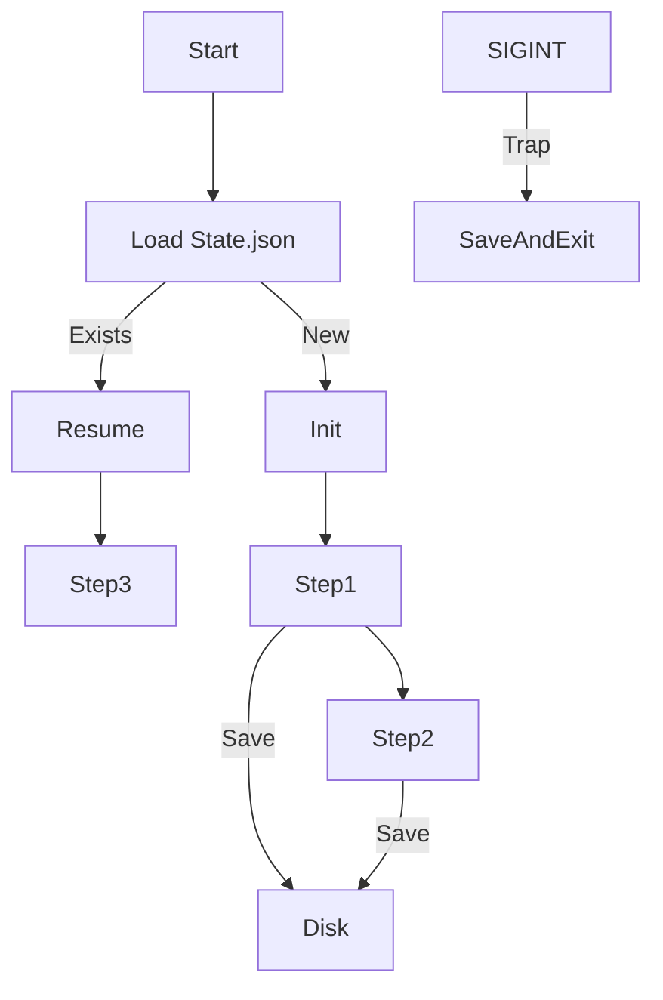

# Graceful Shutdown & State Checkpointing

> **Save your agent's brain to disk so it can survive a crash or restart.**

---

## 🧠 Mental Model

### The Problem
Agents are long-running processes.
If the server restarts (deployment) or crashes, the in-memory state is lost.
"I was in the middle of step 3 of 5..."

### The Solution
**Checkpointing**.
1.  **State Dict**: Defining a serializable structure for the agent (`{"step": 3, "vars": {...}}`).
2.  **Persistence**: Saving to JSON/SQLite after every major transition.
3.  **Signal Handling**: Catching `SIGINT` (Ctrl+C) to save before exiting.

### When to use this
*   [x] Production workers (Celery/Kubernetes).
*   [x] Multi-day research agents.

---

## 🏗️ Architecture

## ⚠️ Risks & Ethics

See [ETHICS.md](ETHICS.md).
- **Stale State**: Resuming an agent with 1-month old context might be confusing.
- **Sensitive Data**: Checkpoint files on disk might contain PII. Encrypt them.
