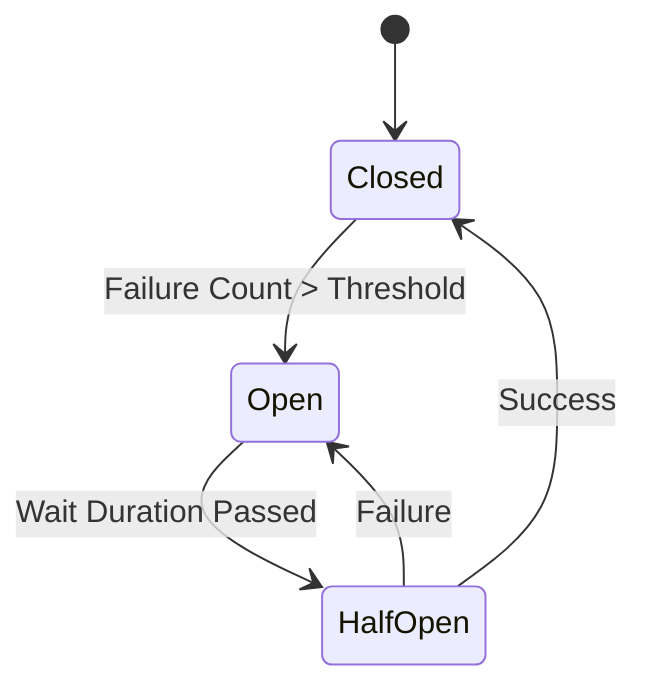

# Circuit Breaker Pattern

> **Stop calling a failing service to prevent cascading failures.**

---

## 🧠 Mental Model

### The Problem
If `Tool A` is down (500 Error), trying to call it 100 times/second is bad.
It wastes tokens, slows down the agent, and might DDoS the recovering service.
Retries (Project 3) handle *transient* blips. Circuit Breakers handle *outages*.

### The Solution
State Machine:
1.  **CLOSED**: Normal operation. Requests go through.
2.  **OPEN**: Failure threshold reached (e.g., 5 fails in 1 min). Requests fail fast (raise immediately).
3.  **HALF-OPEN**: After a cooldown (e.g., 30s), let *one* request through. If success -> CLOSED. If fail -> OPEN.

### When to use this
*   [x] Calling external APIs (Weather, Stock, Search).
*   [x] Database connections.

---

## 🏗️ Architecture

## ⚠️ Risks & Ethics

See [ETHICS.md](ETHICS.md).
- **Silent Failure**: If the breaker is OPEN, the agent might say "I can't do that" without explaining why.
- **Recovery**: How do we alert a human that the circuit is open?
