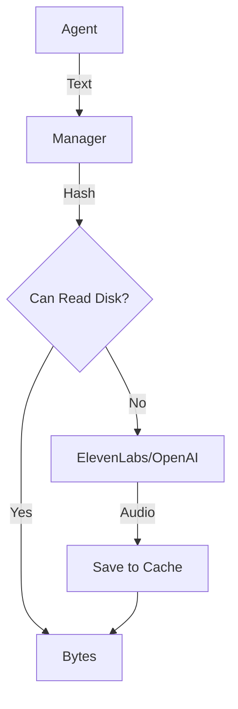

# Text-to-Speech Adapter

> **Give your agent a voice with a consistent interface.**

---

## 🧠 Mental Model

### The Problem
TTS APIs (ElevenLabs, OpenAI) are expensive and have high latency.
Generating the same "Welcome back!" audio 100 times is wasteful.
Streaming audio playback requires handling chunks.

### The Solution
A **TTS Manager**.
1.  **Interface**: `speak(text) -> AudioBytes`.
2.  **Cache**: Hash the text (`md5("Hello")`). If exists on disk, return file.
3.  **Stream**: Yield bytes as they arrive to reduce "Time to First Byte" (TTFB).

### When to use this
*   [x] Voice interactions.
*   [x] Accessibility features.

---

## 🏗️ Architecture

## ⚠️ Risks & Ethics

See [ETHICS.md](ETHICS.md).
- **Voice Cloning**: Do not clone voices without consent.
- **Cost**: Audio generation is significantly pricier than text.
