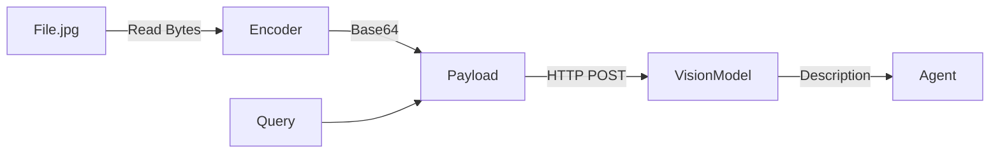

# Multi-Modal Vision Client

> **Allow agents to "see" images by encoding them for Vision APIs.**

---

## 🧠 Mental Model

### The Problem
Agents are usually text-only.
Users want to upload a screenshot of a bug and say "Fix this."
Images must be converted to Base64 (or URLs) to be sent to GPT-4o/Gemini.
Tokens are expensive—resolution handling matters.

### The Solution
A **Vision Wrapper**.
1.  **Encode**: Convert local files to Base64 strings.
2.  **Payload**: Format the request correctly (`{"type": "image_url", ...}`).
3.  **Prompt**: Structure the query ("Describe this image in the context of X").

### When to use this
*   [x] UI/UX testing bots.
*   [x] Analyzing charts/graphs in reports.

---

## 🏗️ Architecture

## ⚠️ Risks & Ethics

See [ETHICS.md](ETHICS.md).
- **Privacy**: Uploading sensitive screenshots (bank accounts, emails) to 3rd party APIs.
- **Biases**: Vision models can hallucinate or exhibit bias in describing people.
