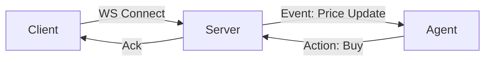

# Real-time Event Streamer

> **Connect agents to live data streams via Websockets.**

---

## 🧠 Mental Model

### The Problem
HTTP is "Request -> Response".
Real world is "Event -> Reaction".
Stock tickers, Chat Apps, and IoT sensors stream data continuously.
Agents need to react to these streams (e.g., "Sell stick if price < $100").

### The Solution
**Websocket Agent**.
1.  **Connect**: Maintain a persistent connection.
2.  **Listen**: `async for message in ws:`.
3.  **Route**: If message type is X, trigger Agent Tool Y.
4.  **Push**: Send results back immediately without waiting for a prompt.

### When to use this
*   [x] Trading Bots.
*   [x] Customer Service Live Chat.
*   [x] Monitoring Systems (Server Alerts).

---

## 🏗️ Architecture

## ⚠️ Risks & Ethics

See [ETHICS.md](ETHICS.md).
- **Overload**: Handling 10,000 events/sec requires specialized architecture (Kafka), not just a Python loop.
- **Race Conditions**: Agent acting on old data because the stream moved too fast.
