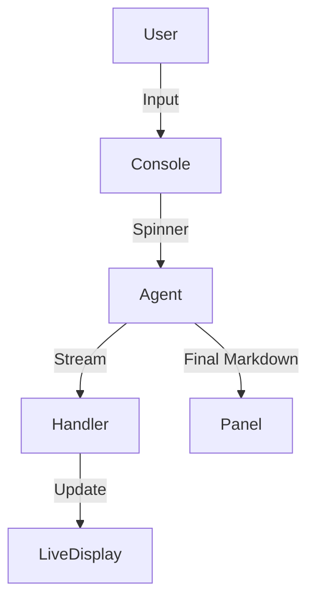

# CLI Agent Interface

> **A professional Terminal User Interface (TUI) for interacting with your agents.**

---

## 🧠 Mental Model

### The Problem
`print()` debugging is ugly.
Streaming tokens in a raw `while True` loop looks messy.
Developers need a clean interface to test agents:
-   Distinguish "System", "User", and "AI" messages.
-   Show "Thinking..." spinners.
-   Pretty-print JSON/Markdown.

### The Solution
**Rich CLI**.
Using the `rich` library to create a structured console UI.
1.  **Console**: Main display object.
2.  **Panel**: Boxed content for distinct messages.
3.  **Markdown**: Rendering agent responses (headers, code blocks).
4.  **Spinner**: Visual feedback during latency.

### When to use this
*   [x] Local development & debugging.
*   [x] Demos for stakeholders (running in terminal).

---

## 🏗️ Architecture

## ⚠️ Risks & Ethics

See [ETHICS.md](ETHICS.md).
- **Accessibility**: CLI tools can be hard for screen readers compared to web UIs.
- **Terminal Width**: Rendering breaks on narrow screens.
