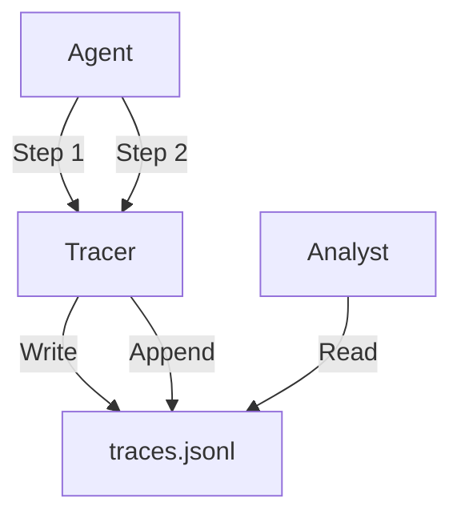

# Trace Logger

> **Record every thought, action, and reaction for debugging and evaluation.**

---

## 🧠 Mental Model

### The Problem
"Why did the agent say that?"
"Which tool failed?"
Console logs are unstructured text. Hard to analyze programmatically.
We need a **Black Box Recorder** for the agent flight.

### The Solution
**Structured JSON Tracing**.
1.  **Run ID**: Unique UUID for the session.
2.  **Steps**: List of events (`{"type": "llm_call", "prompt": "...", "response": "..."}`).
3.  **Storage**: Appending to a `traces.jsonl` or logging to a database.

### When to use this
*   [x] Debugging complex chains.
*   [x] Building a dataset for fine-tuning (filtering successful traces).

---

## 🏗️ Architecture

## ⚠️ Risks & Ethics

See [ETHICS.md](ETHICS.md).
- **PII**: Logs might contain passwords or emails. Sanitize before writing!
- **Disk Space**: Verbose logs grow fast.
