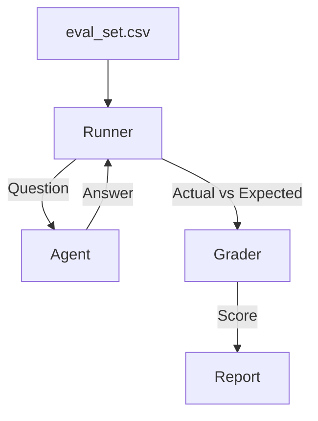

# Golden Dataset Runner

> **Automate the evaluation of your agent against known good examples.**

---

## 🧠 Mental Model

### The Problem
"Did my latest prompt change break the 'Reset Password' flow?"
Manual testing is unscalable.
Agents are non-deterministic, so standard unit tests (`assert result == "OK"`) trigger false positives.

### The Solution
**Evaluation Harness**.
1.  **Dataset**: A list of `Question` -> `Expected Answer` pairs.
2.  **Runner**: Loops through the dataset, calling the Agent.
3.  **Grader**: Compares `Actual` vs `Expected` using:
    *   Exact Match (Strict)
    *   Contains Match ("Reset link" in output)
    *   LLM Grader ("Does A mean the same as B?")

### When to use this
*   [x] Regression testing before deployment.
*   [x] Comparing two different models (Benchmark).

---

## 🏗️ Architecture

## ⚠️ Risks & Ethics

See [ETHICS.md](ETHICS.md).
- **Data Contamination**: Don't train your model on your test set!
- **metric Hacking**: Optimizing for a specific dataset might degrade general performance (Overfitting).
