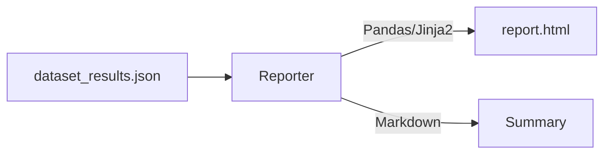

# Benchmark Reporter

> **Turn metrics into insights with beautiful reports.**

---

## 🧠 Mental Model

### The Problem
Project 34 outputs a list of Pass/Fail booleans.
Stakeholders (or you in 2 weeks) need to see:
*   **Aggregate Accuracy**: 85% (Up from 80%? Good!)
*   **Failure Analysis**: WHICH cases failed?
*   **Drift**: Is it faster or slower?

### The Solution
**Report Generator**.
1.  **Input**: Results JSON from the Runner.
2.  **Process**: Aggregate statistics (Mean, Median, P95).
3.  **Render**: Generate a static HTML page with tables and color-coded diffs.

### When to use this
*   [x] Nightly builds.
*   [x] Keeping a history of performance `reports/2023-10-01.html`.

---

## 🏗️ Architecture

## ⚠️ Risks & Ethics

See [ETHICS.md](ETHICS.md).
- **Metric Fixation**: If you only report "Accuracy", you might miss "Safety". Make sure to report multiple dimensions.
