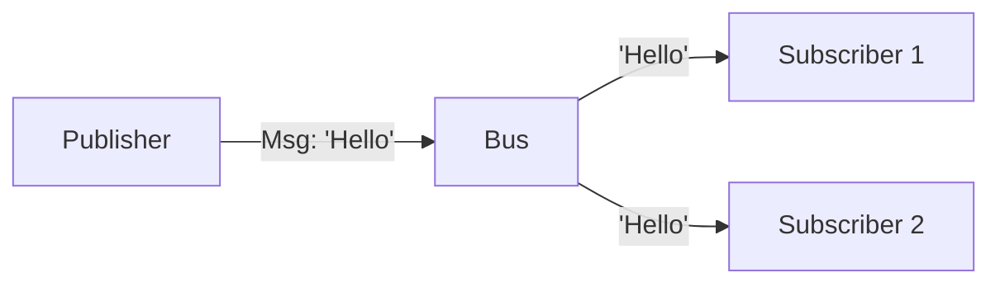

# Simple Message Bus

> **Decouple agents by communicating through channels, not direct calls.**

---

## 🧠 Mental Model

### The Problem
If Agent A calls `agent_b.do_work()`, they are tightly coupled.
If Agent B changes its API, Agent A breaks.
If we want Agent C to *also* listen to Agent A, we have to rewrite Agent A.

### The Solution
**Pub/Sub (Publish-Subscribe)**.
1.  **Bus**: Central post office.
2.  **Publisher**: Sends a message to a `Topic` (e.g., "new_task").
3.  **Subscriber**: Listens to a `Topic`.
4.  **Decoupling**: Publishers don't know who subscribers are.

### When to use this
*   [x] Multi-agent systems where agents come and go.
*   [x] Event-driven architectures (e.g., "UserLoggedIn" -> EmailAgent, AnalyticsAgent).

---

## 🏗️ Architecture

## ⚠️ Risks & Ethics

See [ETHICS.md](ETHICS.md).
- **Complexity**: Debugging event chains is harder than reading linear code (Project 32 helps!).
- **Latency**: Adding a middleman adds a microsecond of overhead per call.
