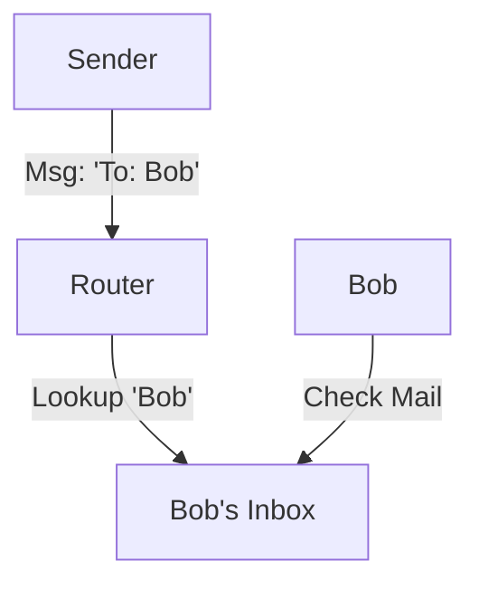

# Point-to-Point Direct Messaging

> **Send a private message to a specific agent by ID.**

---

## 🧠 Mental Model

### The Problem
Broadcasts are noisy. Pub/Sub is decoupled.
Sometimes you just want to say "Hey Bob, handle this file."
Requires a **Directory Service** (Phonebook) to find "Bob".

### The Solution
**Router & Mailboxes**.
1.  **Address**: Every agent has a unique ID (`@agent_a`).
2.  **Router**: Maintains a mapping of `ID -> Agent Instance`.
3.  **Delivery**: `router.send(to="@agent_b", msg="Secret")`.
4.  **Inbox**: Messages queue up in the recipient's mailbox until processed.

### When to use this
*   [x] Delegation (Manager -> Worker).
*   [x] Private negotiation (Buyer <-> Seller).

---

## 🏗️ Architecture

## ⚠️ Risks & Ethics

See [ETHICS.md](ETHICS.md).
- **Spoofing**: Can Agent A pretend to be Agent C? (Need non-spoofable Sender IDs).
- **Dead Letters**: What if "Bob" doesn't exist? (Return to Sender).
