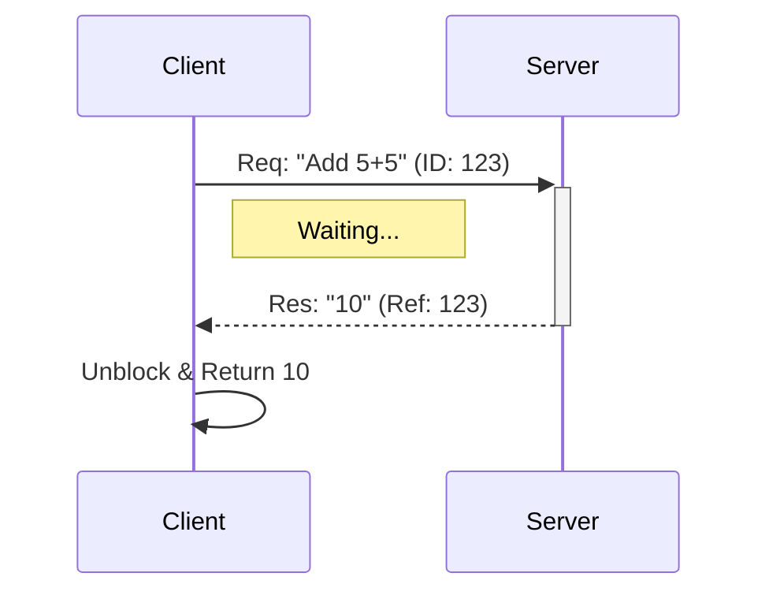

# Request-Response (RPC) Pattern

> **Call a function on another agent and wait for the result.**

---

## 🧠 Mental Model

### The Problem
Async messaging (Project 36/38) is great for decoupling, but hard to code against.
"I sent the request, but where is the answer?"
Developers prefer `result = service.calculate(x, y)`.

### The Solution
**RPC (Remote Procedure Call)**.
1.  **Request**: Send a message with a unique `req_id`.
2.  **Server**: Processes and sends back a message with `reply_to=req_id`.
3.  **Client**: Blocks (waits) until the matching ID arrives, then returns the value.

### When to use this
*   [x] Database lookups.
*   [x] Math calculations.
*   [x] Tightly coupled workflows where Step 2 requires Step 1's output.

---

## 🏗️ Architecture

## ⚠️ Risks & Ethics

See [ETHICS.md](ETHICS.md).
- **Deadlocks**: If Server calls Client while Client is waiting for Server -> Freeze.
- **Timeouts**: Always set a max wait time (e.g., 5s) or the thread hangs forever.
