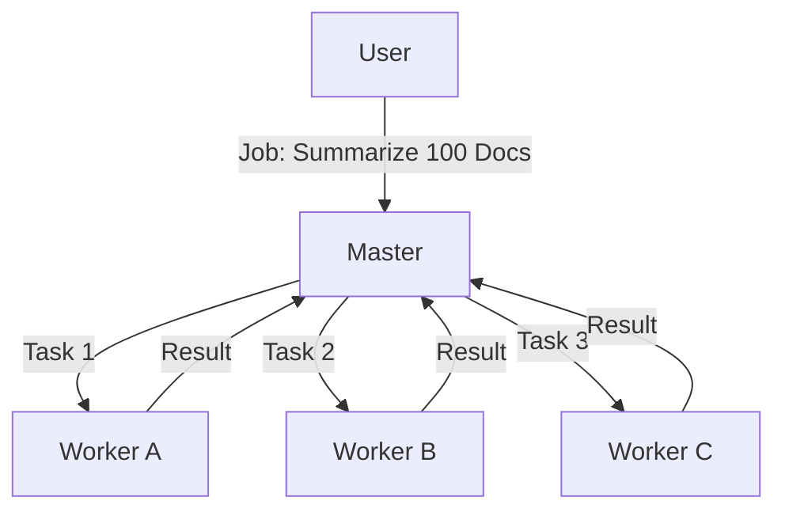

# Master-Worker Controller

> **Centralized task distribution to parallel workers.**

---

## 🧠 Mental Model

### The Problem
You have 100 PDFs to summarize.
One agent doing it sequentially takes 100 minutes.
You want to use 10 agents to do it in 10 minutes.

### The Solution
**Master-Worker Topology**.
1.  **Master**: Holds the "To-Do List" (Task Queue). Assigns work to idle workers.
2.  **Worker**: Dumb execution unit. "Give me a job." -> "Done." -> "Next?"
3.  **Result Aggregation**: Master collects all outputs into a final report.

### When to use this
*   [x] Batch processing (scraping, ETL).
*   [x] Parallelizing independent sub-tasks (Map-Reduce lite).

---

## 🏗️ Architecture

## ⚠️ Risks & Ethics

See [ETHICS.md](ETHICS.md).
- **Bottleneck**: The Master is a single point of failure (SPOF) and performance bottleneck.
- **Stragglers**: If one worker hangs, the whole job might wait (need timeouts).
