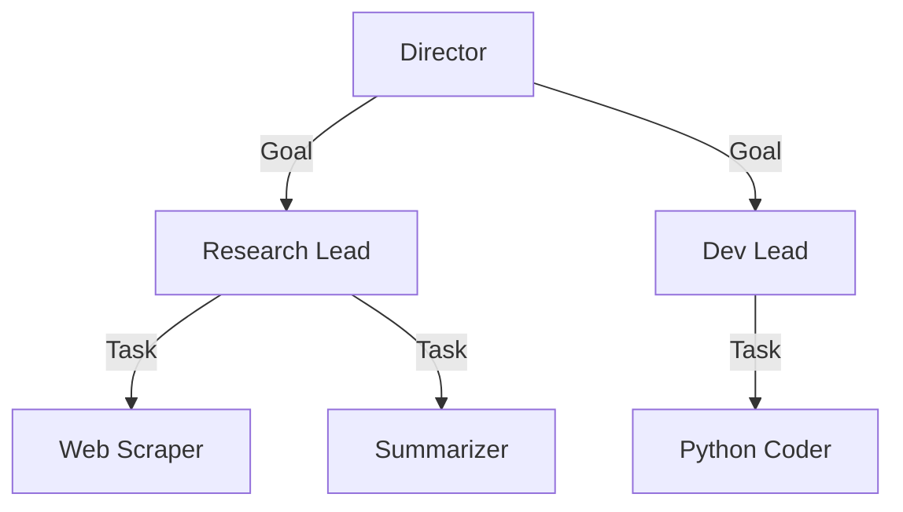

# Hierarchical Teams

> **Scale complexity by layering management.**

---

## 🧠 Mental Model

### The Problem
A single Manager with 100 Workers is hard to coordinate.
Different tasks require different skills (Research vs. Coding).
A flat structure lacks specialization.

### The Solution
**Chain of Command**.
1.  **Director**: High-level goals ("Build App").
2.  **Team Lead**: Breaks goal into domain tasks ("Design DB", "Write API").
3.  **Specialist**: Executes specific task.

### When to use this
*   [x] Complex projects (Software Dev: PM -> Architect -> Dev).
*   [x] Research (Head Scientist -> Lab Manager -> Researcher).

---

## 🏗️ Architecture

## ⚠️ Risks & Ethics

See [ETHICS.md](ETHICS.md).
- **Latency**: Information travels slowly up and down the chain.
- **Telephone Game**: Instructions might get distorted as they pass through layers.
