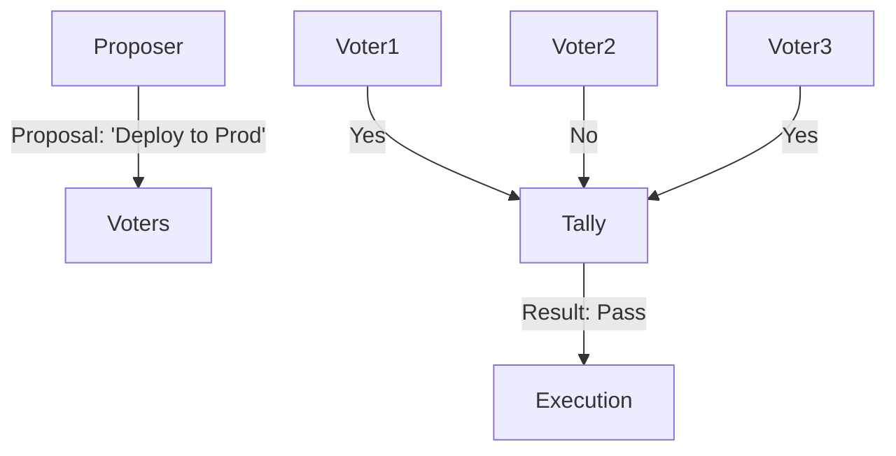

# Peer-to-Peer Consensus

> **Agents voting to reach an agreement.**

---

## 🧠 Mental Model

### The Problem
Three agents analyze a stock.
Agent A: "Buy".
Agent B: "Sell".
Agent C: "Buy".
Who is right?

### The Solution
**Majority Voting (Consensus)**.
1.  **Proposal**: One agent proposes "Action X".
2.  **Vote**: All peers cast a vote (Yes/No/Abstain) based on their private data.
3.  **Tally**: If `Votes > Threshold` (e.g., 50%), the proposal passes.

### When to use this
*   [x] Safety Checks (3 safety agents must agree a prompt is safe).
*   [x] Red Teaming (Aggregating multiple attack vectors).
*   [x] Ensemble methods.

---

## 🏗️ Architecture

## ⚠️ Risks & Ethics

See [ETHICS.md](ETHICS.md).
- **Groupthink**: If all agents use the same underlying model (e.g., GPT-4), they share the same biases.
- **Sybil Attack**: One malicious actor spawning 100 fake agents to rig the vote.
