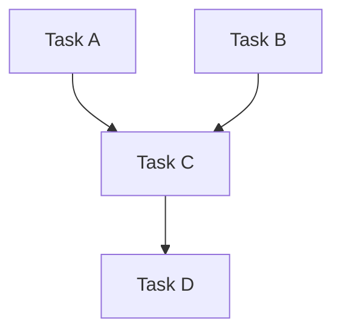

# Graph-based Workflow Engine

> **Manage complex dependencies where Task C needs Task A AND Task B.**

---

## 🧠 Mental Model

### The Problem
Linear chains (`A -> B -> C`) are too simple.
Real life:
*   "Scrape Website" (A)
*   "Download PDF" (B)
*   "Summarize" (C) -> Needs A and B.

### The Solution
**DAG (Directed Acyclic Graph)**.
1.  **Nodes**: Agents/Tasks.
2.  **Edges**: Dependencies (`A -> C`, `B -> C`).
3.  **Scheduler**: Topological Sort ensures A and B finish before C starts.

### When to use this
*   [x] Data Pipelines (ETL).
*   [x] Research Reports (Gather Info -> Analyze -> Write).
*   [x] Software Build Systems (Compile -> Link).

---

## 🏗️ Architecture

## ⚠️ Risks & Ethics

See [ETHICS.md](ETHICS.md).
- **Cycles**: `A -> B -> A`. The system hangs forever. (Need cycle detection).
- **Complexity**: Debugging failed graph states needs good visualization.
