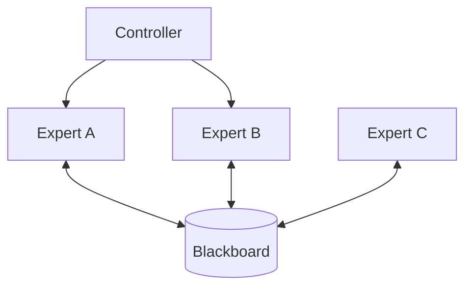

# Blackboard Architecture

> **Agents solving a problem by writing on a shared whiteboard.**

---

## 🧠 Mental Model

### The Problem
Complex problems (e.g., Speech Recognition) require multiple experts (Phonetic, Syntactic, Semantic).
They don't know who needs their output.
They just know "I see a noun phrase here."

### The Solution
**The Blackboard**.
1.  **Blackboard**: A central shared memory.
2.  **Knowledge Sources (KS)**: Agents that watch the board.
3.  **Controller**: Decides which KS gets to write next.
    *   ks_phonetic sees "Audio Wave" -> Writes "Syllables".
    *   ks_lexical sees "Syllables" -> Writes "Words".

### When to use this
*   [x] Non-deterministic problem solving (Crossword puzzles).
*   [x] Sensor fusion (Radar + Lidar + Camera -> Object Map).

---

## 🏗️ Architecture

## ⚠️ Risks & Ethics

See [ETHICS.md](ETHICS.md).
- **Concurrency**: Locking the board is critical if threads write simultaneously.
- **Staleness**: Old hypotheses on the board might confuse new agents.
