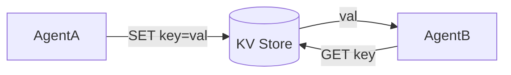

# Distributed Key-Value Store

> **A shared brain for multi-agent systems.**

---

## 🧠 Mental Model

### The Problem
Agent A finds a "Golden Key" in Room 1.
Agent B in Room 2 needs that key.
If they don't share memory, Agent B is stuck.
Passing messages for *every* piece of state is chatty and complex.

### The Solution
**Shared State Store (KV Store)**.
Like Redis or Etcd.
1.  **Set**: `store.set("found_key", True)`
2.  **Get**: `store.get("found_key")`
3.  **Atomic**: Ensures two agents don't overwrite each other simultaneously (locking).

### When to use this
*   [x] Feature Flags (Global switches).
*   [x] Ressource counting (Inventory).
*   [x] Service Discovery (Where is the Database?).

---

## 🏗️ Architecture

## ⚠️ Risks & Ethics

See [ETHICS.md](ETHICS.md).
- **Race Conditions**: Read-Modify-Write bugs if not using locks.
- **Consistency vs Availability**: Simulation of CAP theorem issues (optional).
