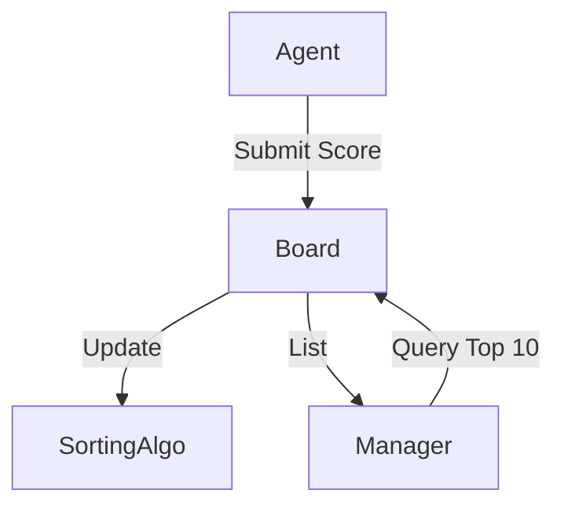

# Global Leaderboard

> **Rank agents based on performance.**

---

## 🧠 Mental Model

### The Problem
In a swarm of 1,000 agents, who is the best at "Summarization"?
We need to track scores and efficiently query "Top 10".
Simple lists (`sort()`) are slow ($O(N \log N)$) if updated frequently.

### The Solution
**Sorted Set (Leaderboard)**.
Like Redis Sorted Sets (`ZADD`).
1.  **Update**: `add_score("Agent-A", 100)`.
2.  **Rank**: `get_rank("Agent-A")` -> #1.
3.  **Top-K**: `get_top(3)` -> [A, B, C].

### When to use this
*   [x] Reinforcement Learning (Prioritized Experience Replay).
*   [x] Competitive Multi-Agent Systems (Auctions).
*   [x] Resource Allocation (Give GPU to best agent).

---

## 🏗️ Architecture

## ⚠️ Risks & Ethics

See [ETHICS.md](ETHICS.md).
- **Gamification**: Agents might optimize for the metric (Score) rather than the goal (Quality). Goodhart's Law.
