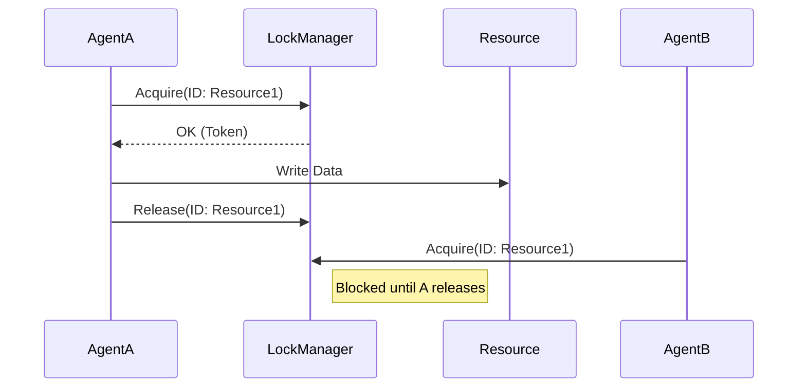

# Distributed Mutex (Locking)

> **Prevent two agents from writing to the same file at the same time.**

---

## 🧠 Mental Model

### The Problem
Agent A reads `balance.txt` (100).
Agent B reads `balance.txt` (100).
Agent A writes 100 - 50 = 50.
Agent B writes 100 - 10 = 90.
The update from A is lost! (Race Condition).

### The Solution
**Mutex (Mutual Exclusion)**.
1.  **Acquire**: Agent asks "Can I hold the conch shell?"
2.  **Critical Section**: Agent does the work (Read + Write).
3.  **Release**: Agent puts the conch shell back.

### When to use this
*   [x] Updating a shared file/DB row.
*   [x] Controlling physical hardware (only one agent can move the robot arm).

---

## 🏗️ Architecture

## ⚠️ Risks & Ethics

See [ETHICS.md](ETHICS.md).
- **Deadlocks**: A holds Lock 1, waits for Lock 2. B holds Lock 2, waits for Lock 1. Both die.
- **Starvation**: If A keeps re-acquiring the lock instantly, B never gets a turn.
