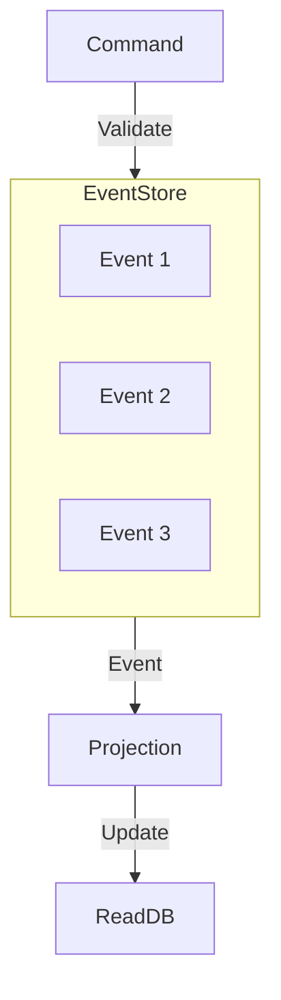

# Event Sourcing Log

> **Don't store state. Store the events that led to the state.**

---

## 🧠 Mental Model

### The Problem
Traditional DBs store `CurrentBalance = 100`.
But *how* did we get there? Did we deposit 200 and withdraw 100? Or deposit 10 ten times?
For Auditing and Time-Travel debugging, we need history.

### The Solution
**Event Sourcing**.
1.  **Events**: Immutable facts (`MoneyDeposited(200)`, `MoneyWithdrawn(100)`).
2.  **State**: Calculated by *replaying* events from t=0.
3.  **Audit**: You can see exactly what happened and when.

### When to use this
*   [x] Financial Systems (Ledgers).
*   [x] Game Saves (Replay match).
*   [x] Agent Memory (Why does the agent think the user is angry?).

---

## 🏗️ Architecture

## ⚠️ Risks & Ethics

See [ETHICS.md](ETHICS.md).
- **GDPR**: "Right to be Forgotten" is hard if events are immutable. You might need "Crypto-shredding" (deleting the key to the event).
- **Performance**: Replaying 1M events to get the current balance is slow (Snapshotting helps).
