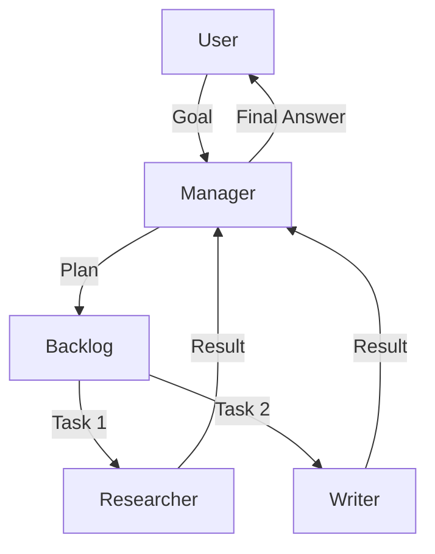

# Manager Agent Pattern

> **"I don't do the work. I make sure the work gets done."**

---

## 🧠 Mental Model

### The Problem
If you ask a generic agent to "Write a research paper," it gets overwhelmed.
It tries to do research, writing, editing, and formatting all in one loop.
It loses context and hallucinates.

### The Solution
**The Manager**.
1.  **Decompose**: Breaks "Write Paper" into:
    *   "Research Topic"
    *   "Draft Outline"
    *   "Write Sections"
    *   "Review"
2.  **Delegate**: Assigns "Research" to the Researcher Agent.
3.  **Aggregate**: Compiles the results into the final output.

### When to use this
*   [x] Complex, multi-step goals.
*   [x] Managing diverse tools that shouldn't be accessible to one agent (security).

---

## 🏗️ Architecture

## ⚠️ Risks & Ethics

See [ETHICS.md](ETHICS.md).
- **Micromanagement**: If the granularity is too fine, the overhead exceeds the work.
- **Blame Assignment**: If the output is bad, was it the Manager's plan or the Worker's execution?
