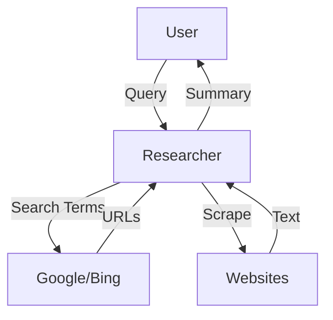

# Research Agent

> **An expert at finding information and summarizing it.**

---

## 🧠 Mental Model

### The Problem
Users ask open-ended questions: "Who is winning the AI race?"
A simple LLM call relies on trained knowledge (cut-off date).
To be current, an agent must browse the web.

### The Solution
**The Researcher**.
1.  **Iterative Search**:
    *   Query 1: "Top AI labs 2026" -> get links.
    *   Query 2: "DeepMind vs OpenAI benchmarks" -> get stats.
2.  **Scraping**: Reading the content of URLs.
3.  **Synthesis**: Writing a report with citations.

### When to use this
*   [x] Market Analysis.
*   [x] Fact Checking.
*   [x] Tech Support (Searching documentation).

---

## 🏗️ Architecture

## ⚠️ Risks & Ethics

See [ETHICS.md](ETHICS.md).
- **robots.txt**: Respect site policies. Don't scrape if disallowed.
- **Misinformation**: If the top search result is fake news, the agent might believe it.
