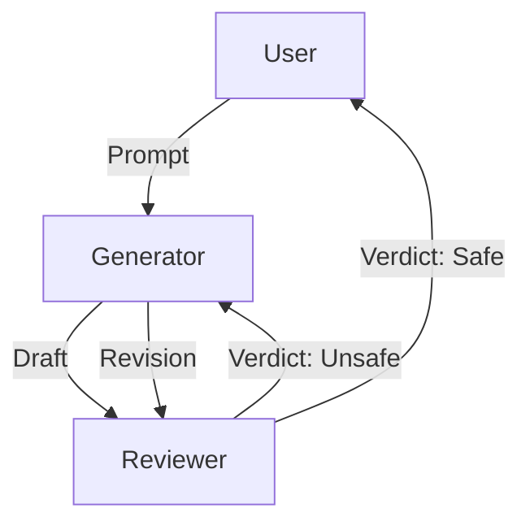

# Review/Safety Agent

> **The gatekeeper that ensures AI outputs are safe and policy-compliant.**

---

## 🧠 Mental Model

### The Problem
Agents can generate harmful content (e.g., SQL injection code, phising emails) if tricked.
Trusting the "Generator" to also be the "Safety Filter" is unreliable.
We need a second pair of eyes.

### The Solution
**The Reviewer**.
1.  **Input**: The draft response from another agent.
2.  **Policies**: A list of rules ("No PII", "No Toxicity", "No Python `eval()`").
3.  **Verdict**: Pass or Fail (with feedback).

### When to use this
*   [x] Public-facing Chatbots.
*   [x] Code Generation (Preventing security vulnerabilities).
*   [x] Enterprise Data (Preventing PII leaks).

---

## 🏗️ Architecture

## ⚠️ Risks & Ethics

See [ETHICS.md](ETHICS.md).
- **False Positives**: Over-zealous filters block legitimate requests (e.g., medical advice flagged as self-harm).
- **Latency**: Doubling the inference cost (Generate + Review).
