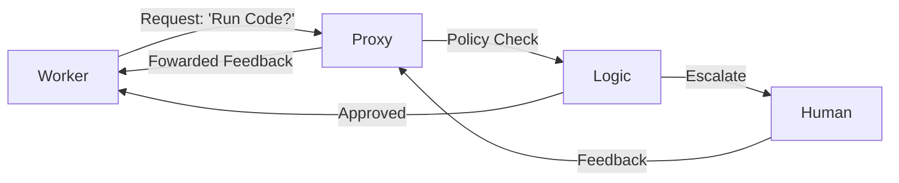

# User Proxy Agent

> **A stand-in for the user to enable autonomous loops.**

---

## 🧠 Mental Model

### The Problem
Agents stop when they need input. "Should I proceed?"
If you want an agent to run fro 24 hours, you can't click "Yes" every 5 minutes.
However, you don't want to give it blank check permission forever.

### The Solution
**User Proxy**.
An agent that sits between the Real User and the Worker Agent.
1.  **Interceptor**: Receives requests from Worker.
2.  **Policy**:
    *   *ALWAYS_ALLOW*: "Yes, proceed."
    *   *ALWAYS_DENY*: "No, stop."
    *   *AUTO_REPLY (N)*: "Yes" for N times, then ask Real User.
    *   *TERMINATE_ON_MATCH*: If result contains "Done", stop.

### When to use this
*   [x] Long-running experiments (Auto-GPT style).
*   [x] Automated Testing (Simulating a user who says "No, try again").
*   [x] Human-in-the-loop (Escalate only critical decisions).

---

## 🏗️ Architecture

## ⚠️ Risks & Ethics

See [ETHICS.md](ETHICS.md).
- **Runaway Costs**: An auto-reply loop consuming API credits.
- **Action risk**: If the proxy auto-approves "Delete Database", it's game over.
