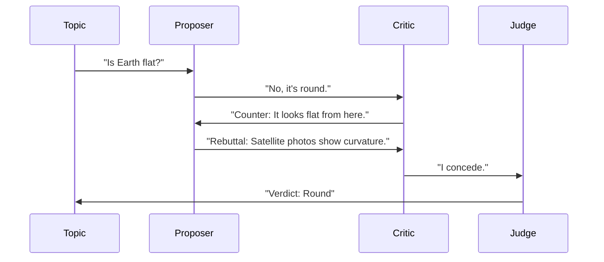

# Multi-Agent Debate

> **Improving truthfulness by letting agents argue.**

---

## 🧠 Mental Model

### The Problem
If you ask one agent "Is X true?", it might hallucinate "Yes".
Single agents are prone to sycophancy (agreeing with the user) and logical blind spots.

### The Solution
**Debate Pattern**.
1.  **Thesis**: Agent A proposes an answer.
2.  **Antithesis**: Agent B critiques it.
3.  **Synthesis**: Agent A (or C) refines the answer based on the critique.
Repeated rounds lead to higher accuracy.

### When to use this
*   [x] Fact-checking complex claims.
*   [x] Improving reasoning capabilities (Chain of Thought).
*   [x] Reducing hallucinations in RAG.

---

## 🏗️ Architecture

## ⚠️ Risks & Ethics

See [ETHICS.md](ETHICS.md).
- **Infinite Arguments**: Agents might argue in circles (Need a max round limit).
- **Personality Clash**: If prompted wrong, agents might just insult each other instead of debating facts.
