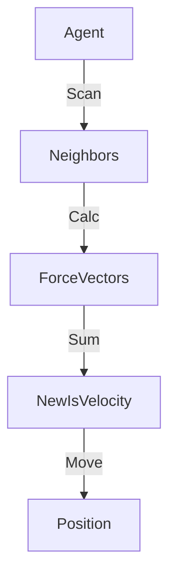

# Swarm Intelligence (Boids)

> **Complex behavior emerging from simple local rules.**

---

## 🧠 Mental Model

### The Problem
Programming a flock of birds explicitly (" Bird 1 follow Bird 2") is brittle.
Centralized control doesn't scale to 1,000,000 drones.

### The Solution
**Emergent Behavior (Boids)**.
Each agent follows 3 simple rules:
1.  **Separation**: Don't crash into neighbors.
2.  **Alignment**: Steer in the same average direction as neighbors.
3.  **Cohesion**: Steer toward the average center of neighbors.

Result: A flock that stays together, turns together, and avoids obstacles, without a leader.

### When to use this
*   [x] Drone Swarms (Search and Rescue).
*   [x] Traffic flow optimization.
*   [x] Game AI (Zombies, Armies).

---

## 🏗️ Architecture

## ⚠️ Risks & Ethics

See [ETHICS.md](ETHICS.md).
- **Unpredictability**: Emergent behavior is hard to debug. The swarm might decide to fly into a wall.
- **Cascading Failures**: One bad agent might lead the whole flock off a cliff (Lemming effect).
