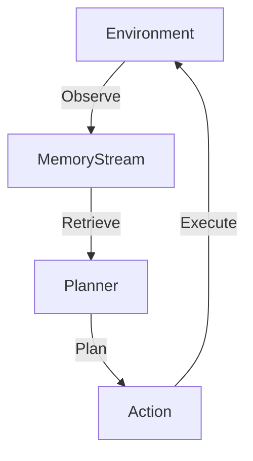

# Generative Town Simulation

> **Simulacra of human behavior.**

---

## 🧠 Mental Model

### The Problem
NPCs in games are scripted trees ("If player nearby -> Attack").
They don't remember you, they don't plan for tomorrow, and they don't gossip.
To create believable worlds, agents need **autonomy**.

### The Solution
**Generative Agents Architecture**.
1.  **Memory Stream**: A list of all observations ("I saw Bob at the park").
2.  **Reflection**: Periodically synthesizing memories ("Bob likes nature").
3.  **Planning**: "I will go to the park to see Bob."
4.  **Reaction**: "Oh, hi Bob!" (Interrupting the plan).

### When to use this
*   [x] Immersive Games (NPCs).
*   [x] Social Scenarios Modeling (Crisis simulation).
*   [x] User Persona Testing (Simulate 100 users trying your app).

---

## 🏗️ Architecture

## ⚠️ Risks & Ethics

See [ETHICS.md](ETHICS.md).
- **Parasocial Relationships**: Users might form deep emotional bonds with simulation agents.
- **Stereotypes**: If the LLM has biases, the town will re-enact those biases.
