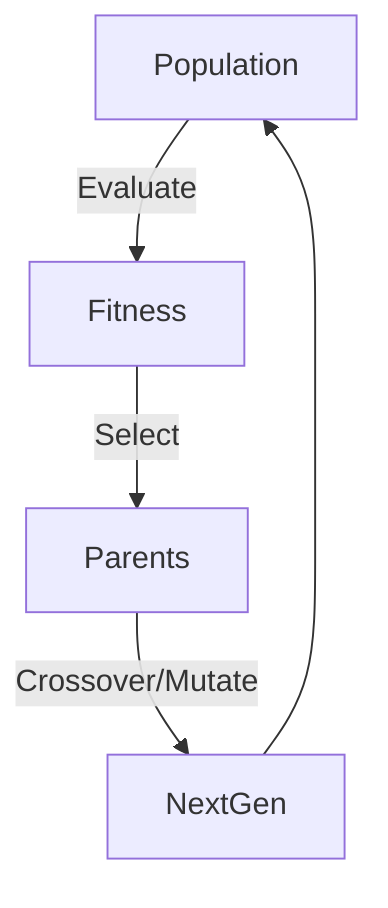

# Evolutionary Agents

> **Survival of the fittest.**

---

## 🧠 Mental Model

### The Problem
You don't know the optimal prompt to solve a math problem.
Or you don't know the best weights for a heuristic.
Trying every combination (Grid Search) is too slow.

### The Solution
**Genetic Algorithm**.
1.  **Population**: Start with 10 random agents.
2.  **Evaluate**: Test them (Fitness Function).
3.  **Select**: Keep the top 50%.
4.  **Crossover**: Combine parents to create children.
5.  **Mutate**: Randomly tweak genes.
6.  **Loop**: Evolution improves performance over generations.

### When to use this
*   [x] Prompt Optimization (DSPy / OPRO).
*   [x] Hyperparameter Tuning.
*   [x] Neural Architecture Search.

---

## 🏗️ Architecture

## ⚠️ Risks & Ethics

See [ETHICS.md](ETHICS.md).
- **Local Optima**: The population might get stuck on a "good enough" solution, missing the best one.
- **Resource Heavy**: Evaluating 100 agents per generation * 50 generations = 5000 runs.
